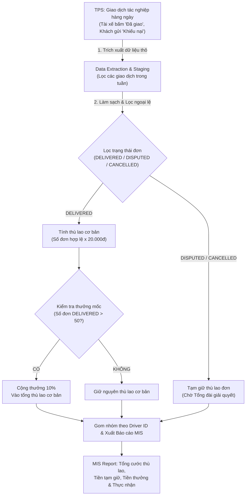

# Báo cáo Phân tích & Thiết kế Hệ thống Thông tin RikkeiExpress
**Môn học:** Phân tích & Thiết kế Hệ thống Thông tin (IT105)  
**Bài tập:** Session 02 - Bài 3 (Vận dụng chuyên sâu): 7 giai đoạn SDLC & Tính thù lao RikkeiExpress

---

## PHẦN 1: DANH MỤC CÔNG VIỆC & SẢN PHẨM ĐẦU RA 7 GIAI ĐOẠN SDLC

### 1. Chi tiết công việc & Deliverables của Kỹ sư Phân tích (SA / BA) theo 7 giai đoạn SDLC

| STT | Giai đoạn SDLC | Công việc cốt lõi của Kỹ sư Phân tích (SA / BA) | Sản phẩm đầu ra (Deliverables) |
| :---: | :--- | :--- | :--- |
| **1** | **Lập kế hoạch**<br>*(Planning)* | • Khảo sát bối cảnh tính thù lao tài xế RikkeiExpress.<br>• Xác định mục tiêu bài toán: Tự động hóa tính thù lao từ TPS sang báo cáo MIS.<br>• Đánh giá tính khả thi (nghiệp vụ, kỹ thuật, thời gian, chi phí).<br>• Lập kế hoạch quản lý rủi ro và phân bổ nguồn lực. | • Bản kế hoạch dự án (Project Plan).<br>• Báo cáo khả thi (Feasibility Study Report).<br>• Mô tả phạm vi dự án (Project Scope Statement). |
| **2** | **Phân tích**<br>*(Analysis)* | • Thu thập yêu cầu nghiệp vụ từ Kế toán và Đội vận hành.<br>• Làm rõ quy tắc thù lao (20.000đ/đơn), thưởng mốc (>50 đơn được 10%), và ngoại lệ khiếu nại (DISPUTED).<br>• Phân tích luồng dữ liệu từ TPS sang MIS.<br>• Xây dựng các kịch bản kiểm thử nghiệp vụ (Business Test Cases). | • Tài liệu Đặc tả Yêu cầu Phần mềm (SRS - Software Requirement Specification).<br>• Sơ đồ luồng dữ liệu (DFD - Data Flow Diagram) TPS ➔ MIS.<br>• Ma trận truy xuất yêu cầu (Traceability Matrix). |
| **3** | **Thiết kế**<br>*(Design)* | • Thiết kế kiến trúc chuyển đổi dữ liệu TPS ➔ MIS.<br>• Thiết kế mô hình dữ liệu (ERD, Data Dictionary for Payout Transactions).<br>• Thiết kế giao diện Báo cáo Tổng cước thù lao (MIS Report Mockup/UI).<br>• Đặc tả thuật toán xử lý tạm giữ khiếu nại và tính thưởng mốc. | • Tài liệu Thiết kế Hệ thống (SDD - System Design Document).<br>• Sơ đồ ERD & Schema CSDL.<br>• Mockup Giao diện Báo cáo MIS cho Kế toán. |
| **4** | **Lập trình**<br>*(Coding)* | • Giải thích và chuyển giao tài liệu đặc tả (SRS/SDD) cho Đội Lập trình (Dev).<br>• Hỗ trợ làm rõ các logic nghiệp vụ cận biên (Edge cases) trong quá trình Dev code.<br>• Giám sát tính tuân thủ quy chuẩn thiết kế của Dev. | • Mã nguồn ứng dụng (Python backend script, DB SQL queries).<br>• Tài liệu Hướng dẫn Code / API Specs.<br>• Kết quả Unit Test của Developer. |
| **5** | **Kiểm thử**<br>*(Testing)* | • Xây dựng kịch bản UAT (User Acceptance Testing) cho Bộ phận Kế toán.<br>• Phối hợp Đội QA/QC kiểm thử chức năng: Đơn DELIVERED, DISPUTED, CANCELLED, vượt mốc 50 đơn.<br>• Xác minh tính chính xác tuyệt đối của con số tài chính trên Báo cáo MIS. | • Kịch bản kiểm thử UAT (UAT Test Cases).<br>• Báo cáo kết quả kiểm thử (Test Execution Report).<br>• Log theo dõi lỗi (Bug Tracking Log). |
| **6** | **Triển khai**<br>*(Deployment)* | • Phối hợp với DevOps/IT Operation để đưa module tính thù lao lên môi trường Production.<br>• Chuẩn bị dữ liệu mẫu và chuyển đổi dữ liệu giao dịch (Data Migration).<br>• Đào tạo Bộ phận Kế toán và Đội Hỗ trợ Tài xế sử dụng tính năng báo cáo mới. | • Biên bản nghiệm thu người dùng (UAT Sign-off Report).<br>• Tài liệu Hướng dẫn Sử dụng (User Manual).<br>• Kế hoạch và Nhật ký Triển khai (Deployment Log). |
| **7** | **Bảo trì**<br>*(Maintenance)* | • Ghi nhận phản hồi từ Kế toán và Tài xế sau khi hệ thống vận hành.<br>• Phân tích các trường hợp phát sinh mới (ví dụ: bổ sung loại hình giao hàng hỏa tốc, khiếu nại sau xử lý).<br>• Đề xuất cải tiến và tối ưu thuật toán tính toán. | • Báo cáo giám sát vận hành (Operational Monitoring Report).<br>• Phiếu yêu cầu thay đổi nghiệp vụ (Change Request - CR).<br>• Nhật ký nâng cấp/bảo trì (Maintenance Log). |

---

### 2. Phân tích hậu quả thực tế của việc bỏ qua khâu Phân tích và Kiểm thử

Trong dự án trước đó của RikkeiExpress, nhóm phát triển đã phạm sai lầm nghiêm trọng khi **nhảy xồ từ Lập kế hoạch sang Lập trình** (bỏ qua khâu **Phân tích** và **Kiểm thử**). Hậu quả thực tế gây ra bao gồm:

1. **Hậu quả từ việc bỏ qua khâu Phân tích (Analysis):**
   - **Bỏ sót logic nghiệp vụ bẫy khiếu nại (Dispute Trap):** Lập trình viên chỉ code logic đơn giản: `Tổng tiền = Số đơn * 20.000đ`. Không có tài liệu SRS quy định trạng thái `DISPUTED` (Khách hàng báo chưa nhận hàng dù tài xế đã bấm thành công), dẫn đến việc hệ thống vẫn trả thưởng cho các đơn đang tranh chấp. Khi phát hiện sai phạm, công ty rất khó đòi lại tiền từ tài xế.
   - **Tính sai logic thưởng mốc (>50 đơn):** Lập trình viên không làm rõ định nghĩa "50 đơn thành công". Nếu tài xế có 52 đơn nhưng trong đó 3 đơn bị khiếu nại (`DISPUTED`), số đơn hợp lệ thực tế chỉ là 49 đơn (chưa đủ mốc 50 đơn để nhận thưởng 10%). Việc thiếu Phân tích khiến code tính thưởng dựa trên tổng đơn trên App, làm phát sinh tiền thưởng sai quy định.

2. **Hậu quả từ việc bỏ qua khâu Kiểm thử (Testing):**
   - **Lỗi phần mềm lọt lưới lên Production:** Các bẫy dữ liệu edge cases (đơn hủy `CANCELLED`, đơn đang tranh chấp `DISPUTED`, tài xế vừa đúng 50 đơn vs 51 đơn) không qua kiểm thử bài bản.
   - **Tranh chấp gay gắt và khủng hoảng niềm tin:** Kế toán phát hiện lệch tiền đối soát với tài xế, tài xế đình công vì bị treo thưởng hoặc trừ tiền không rõ ràng. Chi phí khắc phục sự cố trên Production cao gấp 10-50 lần so với việc phát hiện và sửa lỗi ngay từ khâu Analysis/Testing.

---

## PHẦN 2: THIẾT KẾ LUỒNG XỬ LÝ TPS ➔ MIS & TRIỂN KHAI MÃ NGUỒN (PYTHON)

### 1. Quy trình tuần tự chuyển đổi dữ liệu từ TPS sang MIS



**Các bước tuần tự cụ thể:**
1. **Bước 1: Trích xuất Dữ liệu Giao dịch từ TPS (Data Extraction):** Đọc toàn bộ các bản ghi tác nghiệp trong tuần của tài xế từ CSDL TPS (gồm: `transaction_id`, `driver_id`, `status`, `amount`, `timestamp`).
2. **Bước 2: Phân loại & Xử lý Trạng thái Đơn hàng (Validation & Filtering):**
   - Đơn `DELIVERED`: Tính vào danh mục đơn thành công hợp lệ.
   - Đơn `DISPUTED`: Đơn bị khiếu nại ➔ Đưa vào danh sách **Tạm giữ thù lao** (Hold payout = 20.000đ), không đếm vào tổng đơn thành công để xét thưởng.
   - Đơn `CANCELLED` hoặc khác: Bỏ qua / Thù lao = 0đ.
3. **Bước 3: Tính Thù lao Cơ bản (Base Payout Calculation):**
   $$\text{Thù lao cơ bản} = \text{Số đơn DELIVERED} \times 20.000\text{đ}$$
4. **Bước 4: Kiểm tra Điều kiện Thưởng mốc (Bonus Calculation):**
   - Nếu $\text{Số đơn DELIVERED} > 50$:
     $$\text{Tiền thưởng} = \text{Thù lao cơ bản} \times 10\%$$
   - Ngược lại: $\text{Tiền thưởng} = 0\text{đ}$.
5. **Bước 5: Tổng hợp & Xuất Báo cáo MIS (MIS Aggregation & Reporting):** Gom nhóm dữ liệu theo từng tài xế (`driver_id`), tính `Thực nhận = Thù lao cơ bản + Tiền thưởng`, trình bày dưới dạng Báo cáo MIS định kỳ tuần cho Kế toán.

---

### 2. Triển khai Mã nguồn Python đối soát thù lao tài xế (`calculate_driver_payout`)

Tệp mã nguồn `solution_bai3.py` thực thi thuật toán đối soát chuẩn xác toàn bộ quy tắc nghiệp vụ và edge cases.

```python
import json
from typing import List, Dict, Any

def calculate_driver_payout(transactions: List[Dict[str, Any]]) -> Dict[str, Dict[str, Any]]:
    """
    Tính thù lao tuần, tạm giữ đơn tranh chấp và cộng thưởng mốc cho tài xế RikkeiExpress từ dữ liệu TPS.
    
    Parameters:
        transactions (List[Dict]): Danh sách các giao dịch đơn hàng từ hệ thống TPS.
            Mỗi giao dịch gồm: {
                "transaction_id": str,
                "driver_id": str,
                "status": str ("DELIVERED", "DISPUTED", "CANCELLED", ...),
                "driver_name": str (optional)
            }
            
    Returns:
        Dict[str, Dict]: Báo cáo tổng hợp thù lao MIS theo từng driver_id.
    """
    BASE_RATE = 20000  # 20.000đ / đơn giao thành công
    BONUS_THRESHOLD = 50  # Vượt 50 đơn thành công (> 50)
    BONUS_PERCENTAGE = 0.10  # Thưởng 10% trên tổng thù lao cơ bản

    # Bảng tổng hợp dữ liệu theo tài xế
    driver_summary = {}

    for tx in transactions:
        driver_id = tx.get("driver_id")
        driver_name = tx.get("driver_name", f"Driver_{driver_id}")
        status = tx.get("status", "").upper()
        tx_id = tx.get("transaction_id")

        if not driver_id:
            continue

        # Khởi tạo bản ghi cho tài xế nếu chưa có
        if driver_id not in driver_summary:
            driver_summary[driver_id] = {
                "driver_name": driver_name,
                "total_orders": 0,
                "delivered_orders": 0,
                "disputed_orders": 0,
                "cancelled_orders": 0,
                "disputed_tx_ids": [],
                "base_payout": 0,
                "held_payout": 0,
                "bonus_payout": 0,
                "net_payout": 0
            }

        stats = driver_summary[driver_id]
        stats["total_orders"] += 1

        # Xử lý theo trạng thái đơn hàng (TPS logic)
        if status == "DELIVERED":
            stats["delivered_orders"] += 1
        elif status == "DISPUTED":
            stats["disputed_orders"] += 1
            stats["disputed_tx_ids"].append(tx_id)
            # Tạm giữ 20.000đ thù lao của đơn này
            stats["held_payout"] += BASE_RATE
        elif status == "CANCELLED":
            stats["cancelled_orders"] += 1

    # Tính toán thù lao & thưởng mốc cho từng tài xế (MIS aggregation)
    for driver_id, stats in driver_summary.items():
        # Thù lao cơ bản dựa trên đơn DELIVERED
        delivered_cnt = stats["delivered_orders"]
        base_payout = delivered_cnt * BASE_RATE
        stats["base_payout"] = base_payout

        # Kiểm tra mốc thưởng (> 50 đơn DELIVERED)
        if delivered_cnt > BONUS_THRESHOLD:
            bonus_payout = int(base_payout * BONUS_PERCENTAGE)
        else:
            bonus_payout = 0
        stats["bonus_payout"] = bonus_payout

        # Tổng thực nhận tuần này (không bao gồm tiền đơn bị tạm giữ)
        stats["net_payout"] = base_payout + bonus_payout

    return driver_summary


# =====================================================================
# THIẾT LẬP KỊCH BẢN KIỂM THỬ (TEST CASES & VERIFICATION)
# =====================================================================
if __name__ == "__main__":
    # Dữ liệu giao dịch giả định từ TPS
    sample_tps_transactions = [
        # --- TÀI XẾ DRV001: 52 đơn DELIVERED, 2 đơn DISPUTED (Tổng 54 đơn) ---
        # Đủ điều kiện thưởng 10% (52 > 50 đơn DELIVERED)
        *[{"transaction_id": f"TX_1_{i}", "driver_id": "DRV001", "driver_name": "Nguyen Van A", "status": "DELIVERED"} for i in range(1, 53)],
        {"transaction_id": "TX_1_53", "driver_id": "DRV001", "driver_name": "Nguyen Van A", "status": "DISPUTED"},
        {"transaction_id": "TX_1_54", "driver_id": "DRV001", "driver_name": "Nguyen Van A", "status": "DISPUTED"},

        # --- TÀI XẾ DRV002: Đúng 50 đơn DELIVERED, 3 đơn DISPUTED (Tổng 53 đơn) ---
        # Không đạt mốc thưởng (50 không > 50)
        *[{"transaction_id": f"TX_2_{i}", "driver_id": "DRV002", "driver_name": "Tran Van B", "status": "DELIVERED"} for i in range(1, 51)],
        {"transaction_id": "TX_2_51", "driver_id": "DRV002", "driver_name": "Tran Van B", "status": "DISPUTED"},
        {"transaction_id": "TX_2_52", "driver_id": "DRV002", "driver_name": "Tran Van B", "status": "DISPUTED"},
        {"transaction_id": "TX_2_53", "driver_id": "DRV002", "driver_name": "Tran Van B", "status": "CANCELLED"},

        # --- TÀI XẾ DRV003: 48 đơn DELIVERED, 5 đơn DISPUTED ---
        # Nếu cộng bừa đơn DISPUTED thì thành 53 đơn (sai), nhưng chuẩn ra chỉ có 48 đơn -> Không thưởng.
        *[{"transaction_id": f"TX_3_{i}", "driver_id": "DRV003", "driver_name": "Le Van C", "status": "DELIVERED"} for i in range(1, 49)],
        *[{"transaction_id": f"TX_3_DISP_{i}", "driver_id": "DRV003", "driver_name": "Le Van C", "status": "DISPUTED"} for i in range(1, 6)],
    ]

    payout_report = calculate_driver_payout(sample_tps_transactions)

    print("=" * 85)
    print(" BÁO CÁO TỔNG CƯỚC THÙ LAO TÀI XẾ RIKKEIEXPRESS (MIS REPORT) ".center(85, "="))
    print("=" * 85)
    
    header = f"{'ID':<8} | {'Tên tài xế':<15} | {'Đã giao':<8} | {'Tranh chấp':<10} | {'Thù lao CB':<12} | {'Tạm giữ':<10} | {'Thưởng 10%':<10} | {'Thực nhận':<12}"
    print(header)
    print("-" * 85)

    for drv_id, report in payout_report.items():
        print(f"{drv_id:<8} | "
              f"{report['driver_name']:<15} | "
              f"{report['delivered_orders']:<8} | "
              f"{report['disputed_orders']:<10} | "
              f"{report['base_payout']:>10,}đ | "
              f"{report['held_payout']:>8,}đ | "
              f"{report['bonus_payout']:>8,}đ | "
              f"{report['net_payout']:>10,}đ")

    print("=" * 85)
```
